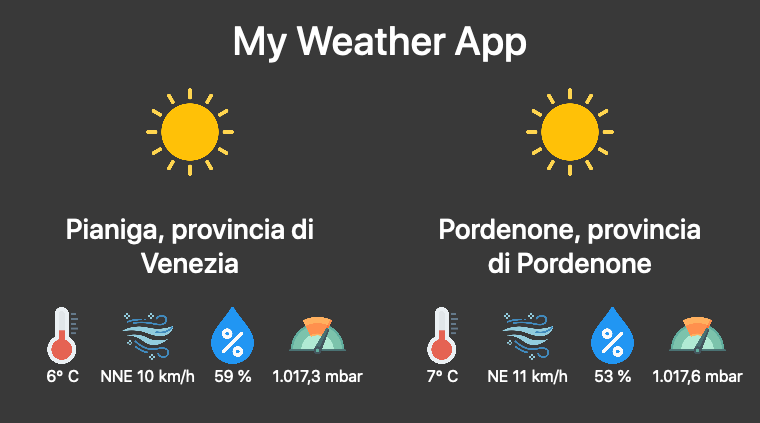

# WeatherApp
 Simple Python app that retrieves and displays the weather
 
 

### Comandi utili 
Per creare un nuovo progetto in Django usare: django-admin startproject NomeApp

Per avviare il server locale di Django, entrare nella cartella WeatherApp e:
_*python manage.py runserver*_

### NB: All icons are from flaticon.com
